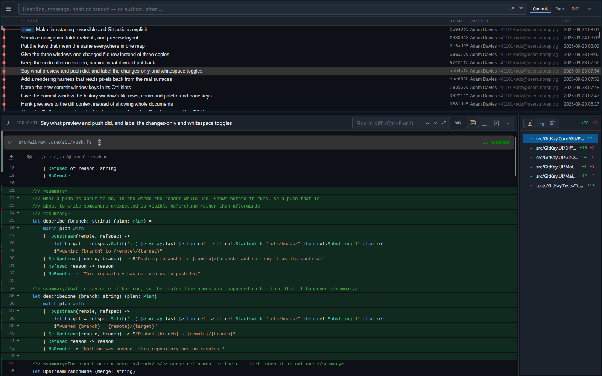
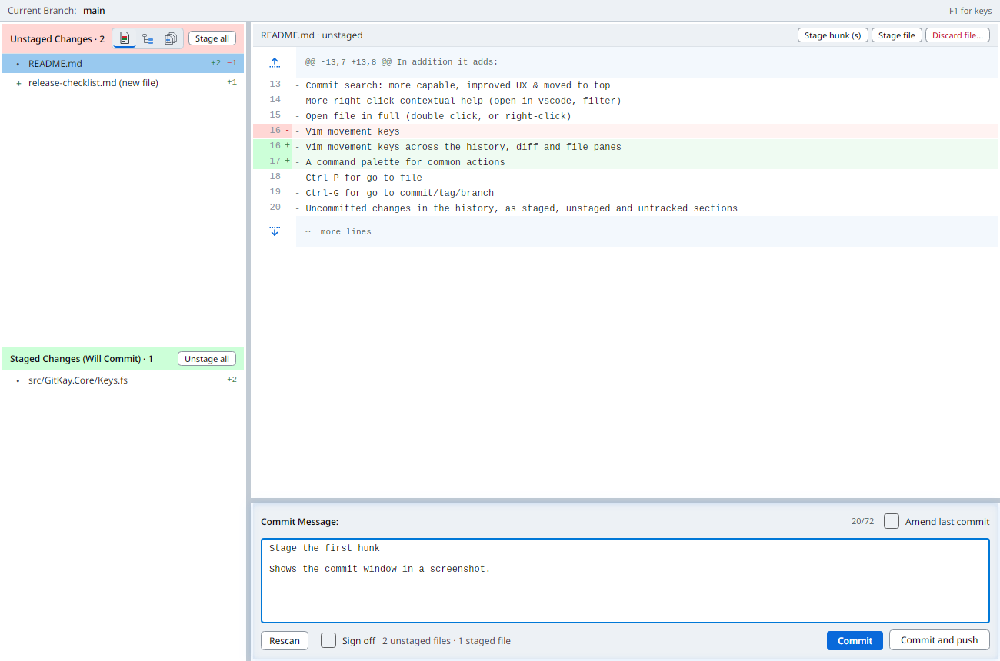

# GitKay

GitKay is a fast Git history viewer built with Avalonia and F#.

Its design goal is to be as close as possible to gitk/git-gui in layout
and interactions with a more modern style.

In addition it adds:

- Syntax colouring
- Commit search: more capable, improved UX & moved to top
- More right-click contextual help (open in vscode, filter)
- Open file in full (double click, or right-click)
- Vim movement keys
- Ctrl-P for go to file
- Ctrl-G for go to commit/tag/branch
- Uncommitted changes in the history, as staged, unstaged and untracked sections
- Stage or discard from the uncommitted diff, with undo for recent line staging and backed-up discards
- Branch actions on branch badges; fetch all remotes or explicitly fetch and prune stale refs
- Light and dark themes, with the pane gap, outline and hover effect you prefer

## Commit window

Staging and committing have their own window, like git gui beside gitk. The history window also lets you stage and discard from its uncommitted changes row.

- **Open it** with `gitkay gui` (or `gitkay-gui`, installed beside `gitkay`), or from the history with `Ctrl+Shift+C`
  or a double-click on the "Uncommitted changes" row.
- **Stage and unstage** whole files, a hunk, or just the lines you select: `s` and `u`, or the buttons.
- **Browse files** as a patch list, folder tree, or all-files tree; use `Ctrl+Shift+P` for commands.
- **Discard** unwanted changes, **amend**, **sign off**, then **Commit** (`Ctrl+Enter`) or **Commit and push**.
- `/` searches the diff, `Ctrl+P` jumps to any changed file, and **F1** lists every key.

## Publish

- `bash scripts/publish-gitkay.sh` builds a self-contained single-file app.
- `bash scripts/publish-gitkay.sh` builds both `win-x64` and `linux-x64` outputs under `artifacts/publish/gitkay/`.
- `bash scripts/publish-gitkay.sh --aot --linux` tries NativeAOT on Linux; use the matching host OS for AOT, and the build stays to one executable with symbols embedded.
