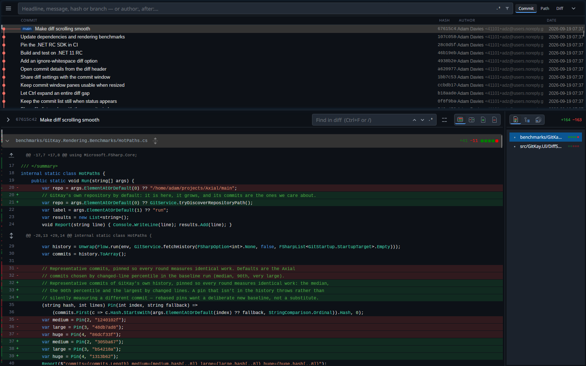
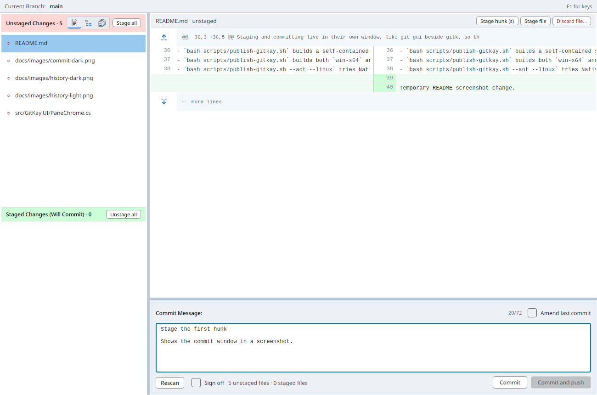

# GitKay

GitKay is a fast, cross-platform Git history viewer with the layout simplicity of gitk + git gui but the browsing experience of GitHub and the keyboard ergonomics of an editor.

Navigate as quickly as you navigate an editor: 

- browse the commit graph,
- jump between files and revisions,
- review branches like a pull request,
- open complete files and rendered Markdown,
- search everywhere,
- and stage individual hunks or lines. 

Use the mouse and familiar GUI controls, or stay entirely on the keyboard with deep Vim navigation, visual selection and command palettes (ctrl-p).

In addition it adds:

- Syntax colouring
- Diff markdown in rendered preview
- Diff Json/XML in pretty printed preview form
- Diff compare images side by side
- Counts of addition/removals per folder and file 
- More capable commit and diff search with improved UX
- More right-click contextual actions (open in vscode, filter)
- Vim movement keys
- Ctrl-G for go to commit/tag/branch

Visually much more modern, with light and dark themes, configurable pane gap, outline and hover effects.

## State and Commit window

Staging and committing have their own window, like git gui beside gitk. The history window also lets you stage and discard from its uncommitted changes row.

Staging or discarding from the uncommitted diff, comes with undo for recent line staging and backed-up discards.

- **Open it** with `gitkay gui` (or `gitkay-gui`, installed beside `gitkay`), or from the history with `Ctrl+Shift+C`
  or a double-click on the "Uncommitted changes" row.
- **Stage and unstage** whole files, a hunk, or just the lines you select: `s` and `u`, or the buttons.
- **Browse files** as a patch list, folder tree, or all-files tree; use `Ctrl+Shift+P` for commands.
- **Discard** unwanted changes, **amend**, **sign off**, then **Commit** (`Ctrl+Enter`) or **Commit and push**.
- `/` searches the diff, `Ctrl+P` jumps to any changed file, and **F1** lists every key.

## Build from source

See releases for downloadable binaries built when releases are tagged.

To build it yourself:

- `bash scripts/publish-gitkay.sh` builds a self-contained single-file app.
- `bash scripts/publish-gitkay.sh` builds both `win-x64` and `linux-x64` outputs under `artifacts/publish/gitkay/`.
- `bash scripts/publish-gitkay.sh --aot --linux` tries NativeAOT on Linux; use the matching host OS for AOT, and the build stays to one executable with symbols embedded.
